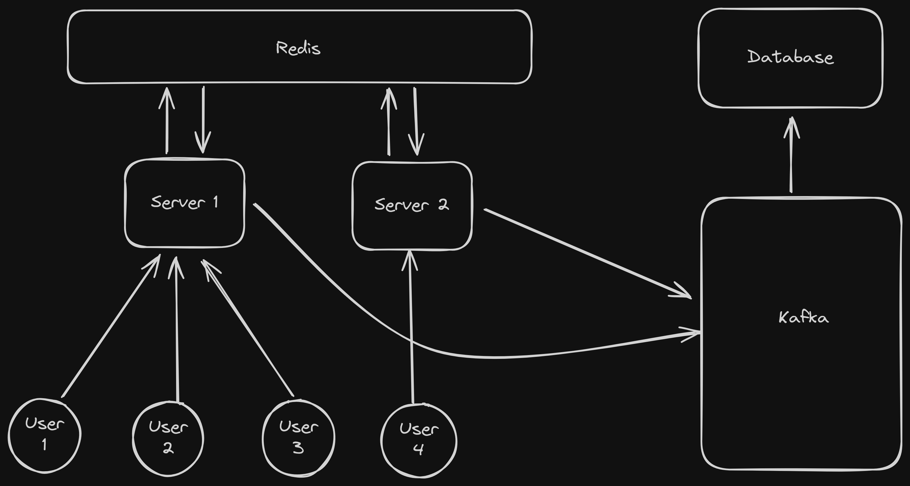

# iChat 2.0

iChat is a simple chat application that allows users to chat with each other in real time. Users can enter a username
and join the chat room.
What make this version is that it hava a <strong>scalable architecture</strong> that can handle thousands of users at
the same time without any problem, utilising Redis and Kafka.

## Architecture

 

## Technologies Used

- Node.js
- Socket.io
- Redis
- Kafka
- Next.js

